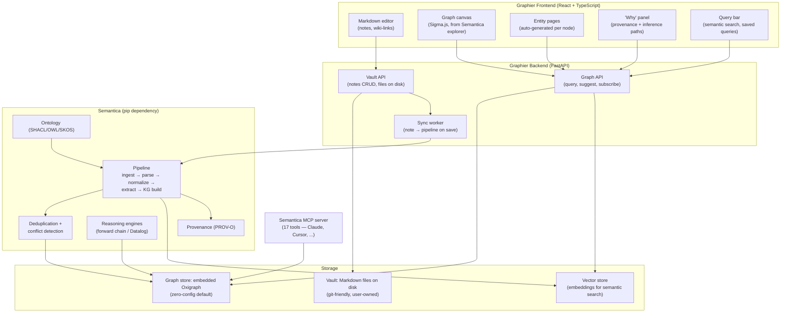
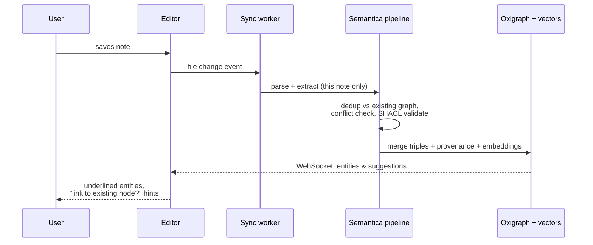

# Graphier — Architecture Sketch

**Graphier = an Obsidian-like knowledge workspace for humans, backed by [Semantica](https://github.com/semantica-agi/semantica)'s graph-native infrastructure.**

Obsidian gives people a great writing surface but an untyped graph: links mean whatever you meant when you typed `[[...]]`. Semantica gives machines a typed, queryable, provenance-tracked knowledge graph but no human-friendly authoring surface. Graphier sits in the middle: you write notes and import documents like in Obsidian, and Semantica's pipeline turns them into a real knowledge graph underneath — typed entities, typed relations, deduplication, conflict detection, reasoning, and source lineage — which the UI then surfaces back to you as suggested links, entity pages, inferred connections, and a graph view that actually means something.

---

## System overview



Three principles anchor the design:

1. **Files first, graph second.** Like Obsidian, the vault is plain Markdown on disk — user-owned, git-friendly, portable. The knowledge graph is a *derived index* built by Semantica's pipeline. Delete the graph store and it can be fully rebuilt from the vault. This kills the scariest failure mode (losing notes to a database) and keeps Obsidian users' mental model intact.
2. **The graph is typed and earned, not drawn.** Entities and relations come from Semantica's extraction pipeline (`semantic_extract` → `kg`), validated against an ontology, deduplicated, and conflict-checked — not from untyped `[[links]]`. Manual wiki-links still work; they become high-confidence edges with the user as provenance source.
3. **Every connection can answer "why".** Any edge, suggestion, or inferred fact in the UI is one click away from its provenance chain (which note, which sentence, which rule fired). This is the feature Obsidian structurally cannot have.

---

## Components

### 1. Vault layer (files)

- Plain Markdown files + frontmatter, organized however the user likes. Attachments (PDFs, images) live alongside.
- A `.graphier/` directory holds derived state: the Oxigraph store, vector index, extraction cache keyed by content hash, and config (`ontology.ttl`, pipeline settings).
- Watcher (watchfiles) detects saves/renames/deletes and enqueues incremental re-extraction — only the changed note, not the whole vault.

### 2. Backend service (FastAPI)

A thin service that wraps Semantica as a library (same stack Semantica itself uses — its `server.py` is FastAPI + uvicorn, so the integration is idiomatic):

- **Vault API** — CRUD on notes, file tree, attachments.
- **Sync worker** — on note save: run `parse → normalize → semantic_extract → kg` for that note; merge into the graph with provenance pointing at the note + character span; run dedup (`deduplication`) and conflict detection (`conflicts`) against the existing graph; store embeddings for chunks.
- **Graph API** — endpoints the UI needs:
  - `GET /graph/neighborhood?node=...&depth=...` — powers the canvas (never ship the whole graph to the browser).
  - `GET /notes/{id}/entities` — entities/relations extracted from a note, with spans, for in-editor highlighting.
  - `GET /suggest?note=...` — link suggestions: entities in this note that match existing graph nodes (this is the "typed autolink" feature).
  - `GET /search?q=...` — hybrid search: vector similarity + graph traversal.
  - `GET /why?edge=...` — provenance chain / inference path for an edge.
  - `POST /query` — saved structured queries (SPARQL under the hood, but users see a query builder).
  - WebSocket for live graph updates as extraction completes.

### 3. Frontend (React + TypeScript)

- **Editor**: CodeMirror 6 Markdown editing with live preview. Extracted entities get subtle underlines; hovering shows the entity's type and graph card; accepting a suggestion writes a normal `[[wiki-link]]` back into the Markdown (so the file stays portable).
- **Graph canvas**: Sigma.js (WebGL) — the same renderer Semantica's `explorer/` uses, so its components are a direct reference/starting point. Color by entity type from the ontology, filter by type/time, expand-on-click neighborhoods.
- **Entity pages**: auto-generated page per graph node — all mentions across notes, relations, conflicting facts flagged, timeline of when facts were added.
- **"Why" panel**: for any edge — source note + sentence (extraction provenance) or the rule chain (inference provenance).
- **Query bar**: natural-language-ish search backed by hybrid vector + graph retrieval; pinnable saved queries rendered as live lists (Dataview, but typed).

### 4. Ontology

Start with a small default ontology (Person, Organization, Place, Concept, Event, Project + a dozen relation types) shipped as `ontology.ttl`. Semantica's ontology module validates extractions against it (SHACL), so junk extractions get quarantined instead of polluting the graph. Power users can edit the ontology; Semantica's visual ontology editor in the explorer is the reference implementation.

### 5. AI access (MCP)

Don't build a chat UI first — expose the vault's graph through Semantica's existing MCP server (17 tools: `search_graph`, `extract_all`, `get_provenance`, `run_reasoning`, `record_decision`, ...). Anyone using Claude Code / Cursor / Claude Desktop can then talk to their Graphier vault immediately: "what do my notes say connects X to Y, and which notes claim it?" This is a big differentiator over Obsidian at near-zero build cost.

---

## Key flows

**Note save → graph update**



**The three link types** (all rendered distinctly in the canvas):

| Edge origin | Example | Confidence |
|---|---|---|
| Manual `[[wiki-link]]` | user typed it | highest, user is provenance |
| Extracted | "Ada founded Acme" → `Ada —founded→ Acme` | pipeline confidence score, sentence-level provenance |
| Inferred | rule: `founded(x,c) ∧ acquired(b,c) ⇒ connected(x,b)` | derivation chain as provenance |

Inferred edges are the "aha" feature: connections across notes the user never drew, each fully explainable.

---

## What this gives you that Obsidian can't

- Typed entities and relations instead of untyped links; the graph view becomes queryable, not just pretty.
- Automatic link suggestions from extraction — the graph builds itself as you write.
- Inferred connections from deterministic reasoning, with visible derivations.
- Conflict detection: two notes stating contradictory facts get flagged, not silently coexisting.
- Semantic + graph hybrid search rather than keyword search.
- Time travel: graph snapshots — "what did I know about this project in March?"
- Any MCP-capable AI assistant gets structured, provenance-backed access to your vault.

**Kept from Obsidian:** local-first Markdown, user owns the files, works offline, no SaaS dependency (Semantica is self-hosted/embedded by design).

---

## Proposed repo layout

```
graphier/
├── backend/
│   ├── graphier/
│   │   ├── vault/          # file watching, notes CRUD
│   │   ├── sync/           # incremental extraction worker
│   │   ├── graphapi/       # query/suggest/why endpoints
│   │   └── main.py         # FastAPI app
│   └── pyproject.toml      # deps: semantica, fastapi, watchfiles
├── frontend/
│   └── src/
│       ├── editor/         # CodeMirror 6 + entity highlights
│       ├── canvas/         # Sigma.js graph view
│       ├── entity/         # entity pages, "why" panel
│       └── query/          # search + saved queries
├── ontology/
│   └── default.ttl         # starter ontology
└── docs/
```

---

## Phased build

| Phase | Deliverable | Semantica pieces used |
|---|---|---|
| **1. Walking skeleton** | Vault CRUD + editor; on save, extract entities and show them underlined; embedded Oxigraph | `parse`, `semantic_extract`, `kg`, `graph_store` |
| **2. The graph earns its keep** | Graph canvas (neighborhoods), entity pages, link suggestions, hybrid search | `embeddings`, `vector_store`, `deduplication` |
| **3. Trust features** | "Why" panel (provenance), conflict flags, ontology validation | `provenance`, `conflicts`, `ontology` |
| **4. Intelligence** | Inference rules + inferred edges, time-travel snapshots, MCP server exposure | `reasoning`, temporal KG, `mcp` |

Phase 1 is deliberately small: a note-taking app where entities light up as you type is already a demo nobody else has, and every later phase is additive on the same pipeline.

## Risks / open questions

- **Extraction quality on personal notes.** Semantica's NER/relation extraction is tuned for documents; terse personal notes may extract noisily. Mitigation: confidence thresholds, suggestions-not-auto-links by default, and the ontology's SHACL validation as a junk filter. Prototype this first — it's the load-bearing assumption.
- **Incremental updates.** Verify the pipeline handles single-note re-extraction + merge cleanly (retract old triples from that note's provenance, insert new ones) rather than full rebuilds. Provenance makes this tractable: every triple knows its source note.
- **Python 3.8+ / heavy deps.** Semantica pulls substantial NLP dependencies; packaging Graphier as a desktop app (Tauri/Electron wrapping the FastAPI server) needs a bundling story. Web-app-first sidesteps this.
- **License**: Semantica is MIT — no constraint on Graphier's model.
