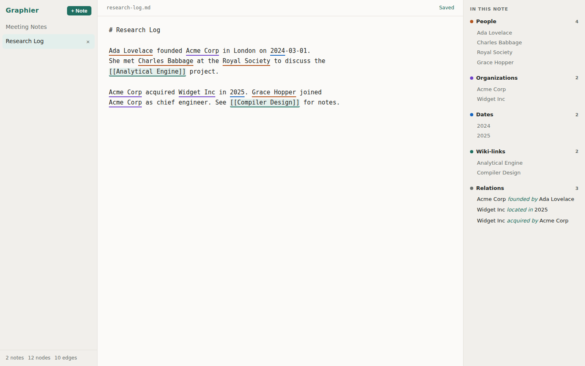
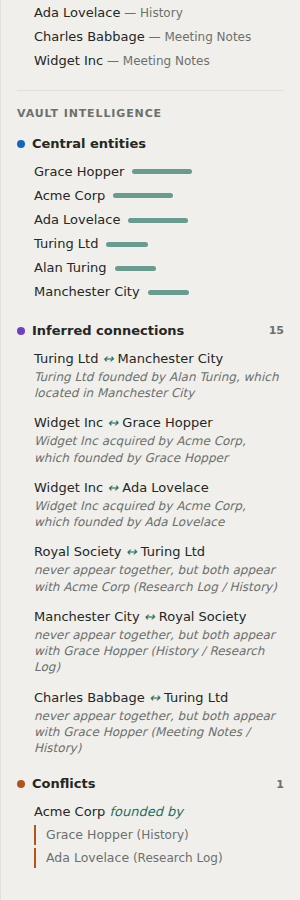
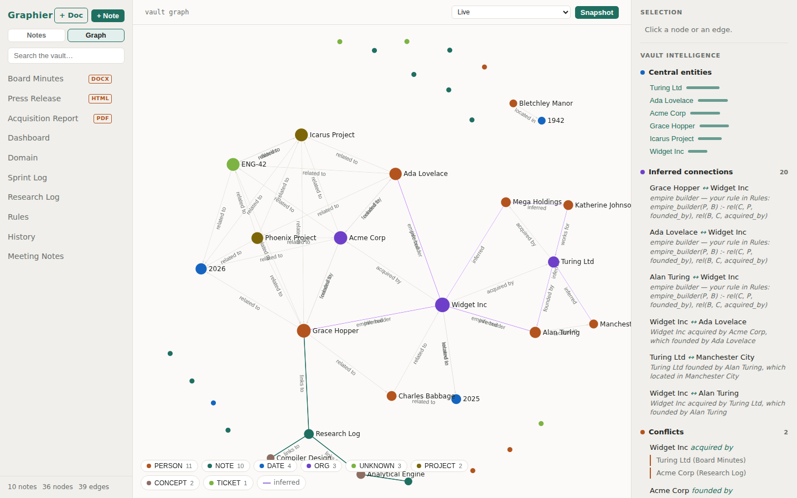
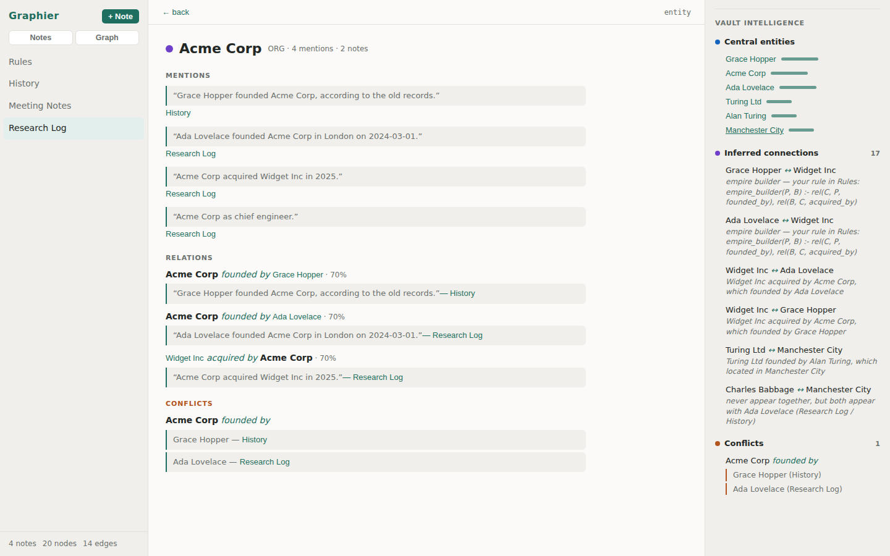

# Graphier

An Obsidian-like knowledge workspace where the graph builds itself.

You write plain Markdown notes; [Semantica](https://github.com/semantica-agi/semantica)'s
deterministic extraction pipeline turns them into a typed knowledge graph
underneath — people, organizations, places, and dates light up as you type,
relations are extracted with confidence scores, and `[[wiki-links]]` become
explicit edges. See [ARCHITECTURE.md](ARCHITECTURE.md) for the full design.

**Status: Phase 1 + vault intelligence** — vault CRUD, live entity extraction
with in-editor underlines, entity/relations panel, vault-wide graph
aggregation, and a deterministic enrichment layer:

- **Inferred connections** — Semantica's Datalog reasoner forward-chains rules
  over extracted facts: multi-hop chains ("Widget Inc ↔ Ada Lovelace, because
  Widget Inc was acquired by Acme Corp, which was founded by Ada Lovelace")
  and hidden bridges ("X and Y never appear together, but both appear with
  Z"). Every inference carries its derivation.
- **Conflict detection** — the same subject + predicate asserted differently
  in different notes gets flagged with both sources ("Acme Corp founded by:
  Grace Hopper (History) vs Ada Lovelace (Research Log)").
- **Link suggestions** — entities in the current note that other notes also
  mention.
- **Central entities** — PageRank over the vault graph via Semantica's
  CentralityCalculator: what your vault actually revolves around.
- **Graph canvas** — a force-directed Sigma.js view of the whole vault, nodes
  colored by type and sized by mentions. Click a node or edge for its
  provenance (which notes it came from, extraction confidence, manual vs
  extracted); double-click a node to jump to its note.
- **Entity pages with sentence-level provenance** — click any entity name to
  see everything the vault knows about it: every mention quoted verbatim with
  its source note, every relation backed by the exact sentence that asserted
  it, plus the conflicts and inferences it participates in.
- **One-click linking** — accept a link suggestion and the `[[wiki-link]]` is
  written into your Markdown for you.
- **Hybrid search** — TF-IDF ranking over note bodies, graph-boosted: a note
  that *mentions the entity you searched for* outranks one that merely shares
  vocabulary, and matching entities surface as chips that open their entity
  pages.
- **Time travel** — the vault is a git repo. Take a snapshot anytime; the
  graph view's timeline selector replays the knowledge graph exactly as it
  was at any snapshot — the past still knows what the present forgot.
- **Domains: your vault defines its own entity types** — put a
  ```` ```domain ```` block in any note and declare types as `LABEL: regex`:

  ~~~markdown
  ```domain
  PROJECT: \b(?:Phoenix|Icarus) Project\b
  TICKET: \bENG-\d+\b
  ```
  ~~~

  Domain types are extracted across the whole vault with higher confidence
  than the generic patterns (they win on overlap), get their own colors in
  the editor, panel, and graph canvas, and flow through everything —
  entity pages, search chips, inference, PageRank. Built-in labels can't
  be shadowed; malformed regexes contribute nothing.

  Lines with `{TYPE}` placeholders declare **typed relations**:
  `BLOCKS: {TICKET} blocks {PROJECT}` turns "ENG-42 blocks the Icarus
  Project rollout" into a `blocks` edge between the two typed entities —
  components must appear in order within one sentence, filler words
  allowed. Template edges carry sentence evidence and feed conflicts and
  inference like any extracted relation.
- **Live query notes** — a ```` ```query ```` block renders always-current
  results in the panel, one query per line:

  ~~~markdown
  ```query
  relations blocks
  entities TICKET
  ?- empire_builder(P, B)
  ```
  ~~~

  `entities LABEL`, `relations predicate`, and `connected Entity Name`
  query the graph; `?- pred(X, Y)` runs a Datalog query against the
  vault's facts *and your own rules*. Results update on every save —
  Dataview, but against a knowledge graph with a reasoner behind it.
- **Document sources: PDF, HTML, DOCX, TXT** — drop a file into the vault
  (the **+ Doc** button, or just copy it in). Text is extracted (`pypdf`
  for PDFs; stdlib parsers for HTML — scripts/styles stripped — and DOCX)
  and runs through the exact same pipeline: entities and relations
  (including your domain types), sentence evidence pointing back into the
  document, search, suggestions, inference, and queries all treat it as a
  read-only source alongside your Markdown notes. Scanned/image-only PDFs
  need OCR and are rejected with a clear error.
- **Chronology** — the Timeline view orders every dated fact across the
  whole vault: ISO dates, "March 1948", "12/06/1952", or bare years,
  found in Markdown prose or inside PDFs, Word documents, and HTML pages
  alike. Each event shows the exact sentence, its source (with format
  badge), and clickable chips for the entities involved.
- **Your rules program the reasoner** — put a ```` ```datalog ```` block in
  any note and its Horn clauses join the inference engine:

  ~~~markdown
  ```datalog
  empire_builder(P, B) :- rel(C, P, founded_by), rel(B, C, acquired_by)
  ```
  ~~~

  Derived facts show up as inferred connections, citing your rule and the
  note it lives in. `rel(Subject, Object, predicate)` are extracted
  relations; `comention(A, B, note)` are co-mentions.

<p>
  
  
</p>





## Run it

Backend (Python 3.10+):

```bash
python3 -m venv .venv
# Lean install: pattern-based extraction only, no ML downloads
.venv/bin/pip install --no-deps semantica
.venv/bin/pip install numpy pandas fastapi "uvicorn[standard]"
# (Or `pip install -e backend` for the full Semantica install with ML extras.)
```

Frontend (Node 18+):

```bash
cd frontend
npm install
npm run build        # served by the backend from frontend/dist
```

Start:

```bash
GRAPHIER_VAULT=./vault .venv/bin/python -m uvicorn graphier.main:create_app \
    --factory --app-dir backend --port 8000
```

Open http://127.0.0.1:8000 — create a note and start typing. For frontend
development, `npm run dev` proxies `/api` to the backend on port 8000.

## Tests

```bash
.venv/bin/pip install pytest httpx
cd backend && ../.venv/bin/python -m pytest tests/
```

## How it fits together

```
frontend/   React + CodeMirror 6 — editor with entity underlines, entity panel
backend/    FastAPI — vault CRUD, extraction API, graph aggregation
  graphier/vault.py        Markdown files on disk (the source of truth)
  graphier/extraction.py   Semantica pattern NER/relations, cached by content hash
  graphier/graph.py        vault-wide graph: deduped entities + relation/wiki-link edges
```

The vault is always the source of truth: the graph is a derived index and can
be rebuilt from the files at any time. Extraction is deterministic (no LLM,
no network) — Semantica's pattern extractors run on an offset-preserving
masked copy of each note so spans map exactly onto what you typed.
